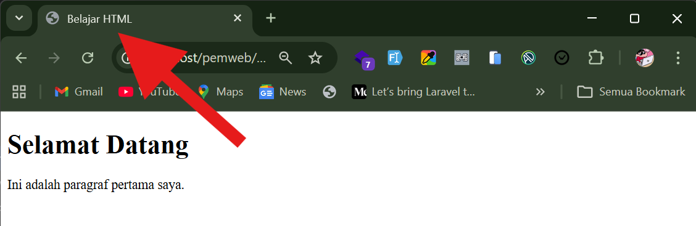
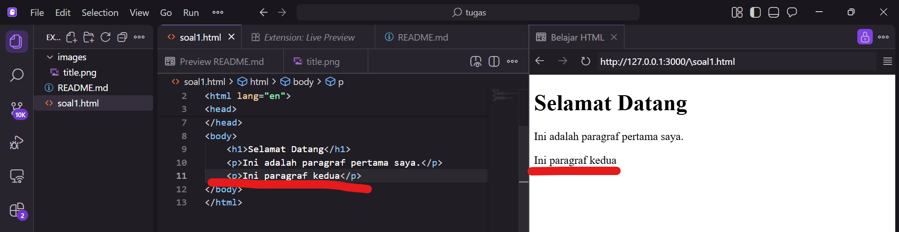
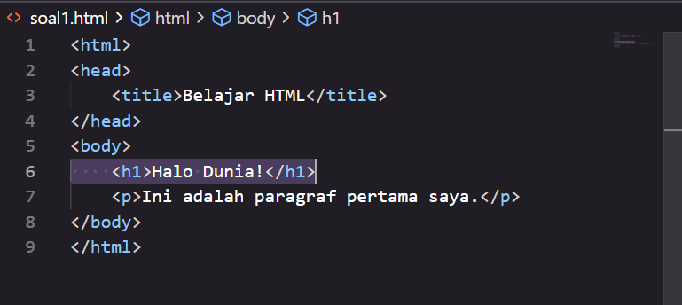

## Jawaban Soal 1

### 1. Tag `<title>` berfungsi untuk:
- Menampilkan judul halaman di tab browser
- Menjadi nama halaman saat di-bookmark
- Digunakan mesin pencari sebagai judul hasil pencarian

Berikut ini saya tampilkan contoh dari title pada web:



### 2. Jika ingin menambahkan paragraf kedua
```html
<p>Ini paragraf kedua</p>
```

Karena <p> adalah tag untuk membuat paragraf. Simpel. Tidak perlu ritual tambahan.

### Ubah kode agar menampilkan "Halo Dunia!" dengan heading terbesar

Heading terbesar di HTML adalah <h1>.

Kode yang sudah diubah:
